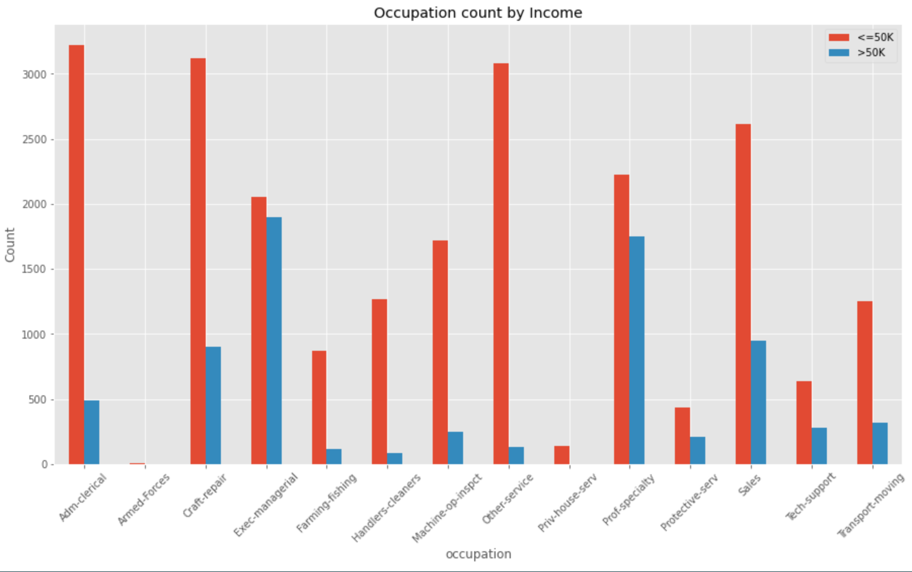
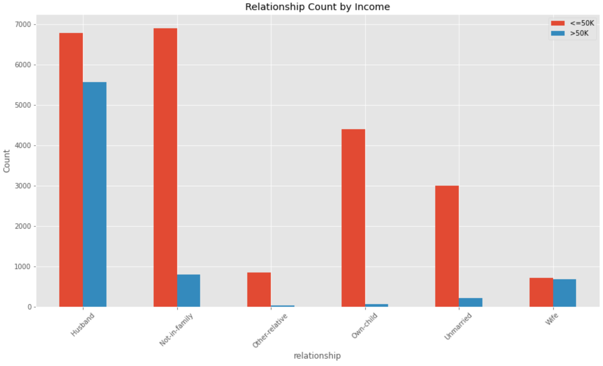
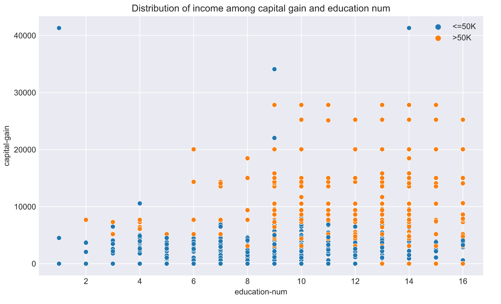
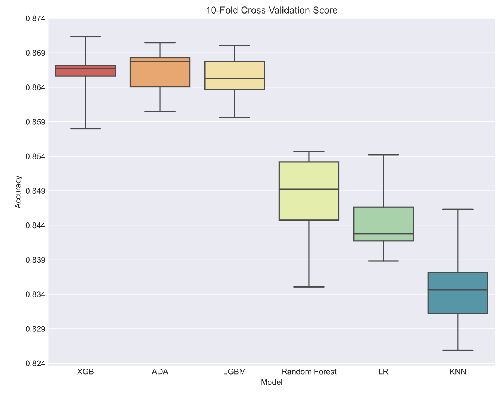
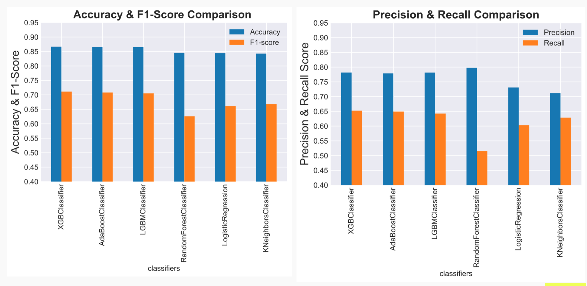
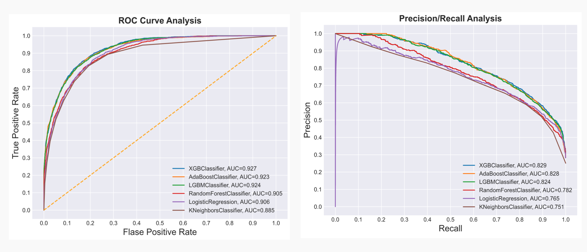
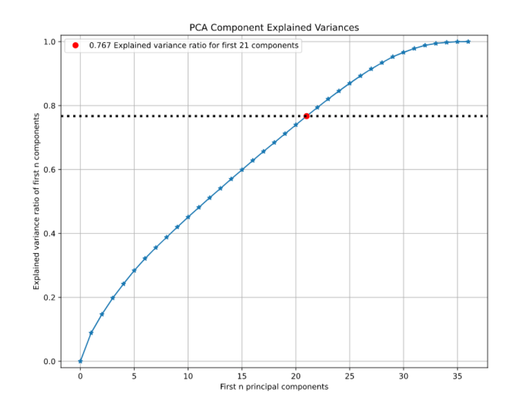

# Income Prediction Classification Model

<strong>DATASET: UCI ADULT DATASET</strong>

 <strong>DETAILS: </strong>
 <ul>
 <li> Building model with UCI Adult Dataset to predict if a person is earning >50K per year. </li>
 <li> Comparing the preformance between XGBoost, LightGBM, AdaBoost, Random Forest, Logistic Regression & KNN. </li>
 <li> Hyperparameter tuning with GridSearchCV and 10-fold cross validation.</li>
 <li> Evaluating the model using PCA, ROC curve & Precision-Recall curve. </li>
 <li> Further comparing the three best-preforming boosting model with less components and oversampled data. </li>
 </ul>

<strong>DATA CLEANSING:</strong>
<ul>
<li> Drop rows for NA data - with '?'</li>
<li> String strip for empty spacing</li>
<li> Identify outliner in capital gain</li>
<li> One hot encoding for categorical fields </li>
<li> Identify column with weak correlation </li>
</ul>

<strong>EDA:</strong>
<ul>
<li>People with Occuption of Exec-managerial, Prof-speciality, Sales & Craft Repair in US are more likely to earn more than 50K per annum. </li>

<li>There are higher chance that a husband or wife earn more than 50K comparing to people who are not-in-familt and unmarried.</li>

<li>From a scatter plot, we can see the distribution of the two income classes with respect to capital gain (investment gain) and education.</li>

</ul>
<strong>MODEL EVALUATION:</strong>
 
<ul>
<li>After using GridSearchCV for hyperparameter tuning, a 10-fold cross validation is done to check the preformance of each model. All model scored an over 0.8 accuracy while XGBoost, LightGBM and ADABoost have better preformance. We can see ADABoost have a higher median but XGBoost have a more stable result.
 </li>

 <li>All three boosting model obtain a very similar results in ROC and Precision/Recall.</li>

<li>From the PCA evaluation curve, we may see that all components weights are quite weak. Reducing components may not benefit the model.</li>

</ul>

<h2>Real-life Example: Prediction US President Income</h2>
<ul>
 <li>Obtained all Class 1 for all 6 models (income >50K), which is accurately predicted.</li>
 </ul>
<ul>
  <strong>Donald Trump Data (Source: Wikipedia/Forbes):</strong>
  <li>workclass: Federal­gov</li>
  <li>marital-status: Married­civ­spouse</li>
  <li>occupation: Exec­managerial</li>
  <li>Sex: Male </li>
  <li>Age: 74</li>
  <li>education-num:13</li>
  <li>Capital-gain: 434,900,000</li>
  <li>Capital-loss: 47,400,000</li>
  <li>Hours-per-week: 42</li>
</ul>
 

<h3>Full code (More evaluation on over-sampling and coefficient reduction) can be viewed <a href="./us-income-1994.ipynb">here</a> on github.</h3>
